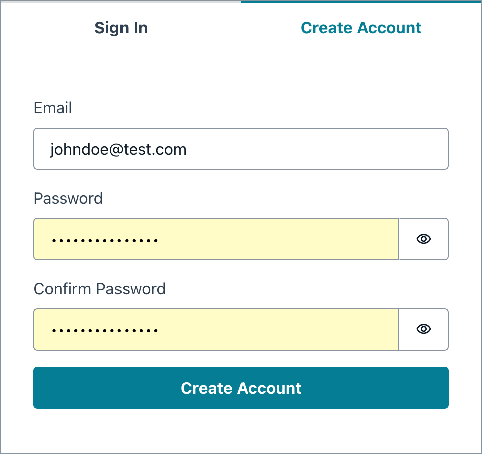

# AI Recipe Generator

AI Recipe Generator is a serverless web application that lets users generate creative recipe ideas from a list of ingredients. It leverages AWS Amplify to manage frontend hosting, backend APIs, authentication, and continuous deployment. The backend integrates with Amazon Bedrock using the Claude 3 Sonnet foundation model to process ingredient inputs and generate recipe suggestions.

## Interface

### Authentication

The registration process is managed by AWS Cognito.

    

### Interaction

Once authenticated, users can enter a list of ingredients to generate creative recipe ideas. The application processes the input and provides suggestions using the Claude 3 Sonnet foundation model.

    

## Project Architecture

The architecture of this application leverages multiple AWS services. The diagram below shows how the services connect:

